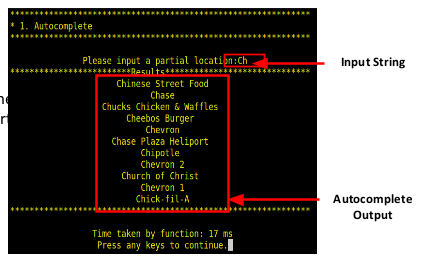

# EE538 Final Project - TrojanMap
Authors: Nikhil Manjunath, Krishna Dheeraj Krovi

Video: https://youtu.be/hKBkNgVSnCw

## TrojanMap
Trojan Map maps the region around USC using C++ Data Structures and Graph Algorithms as shown below:

<p align="center"></p>

Each point on the map is represented by the class **Node** shown below and defined in [trojanmap.h](src/lib/trojanmap.h).

```cpp
class Node {
  public:
    Node(){};
    Node(const Node &n){id = n.id; lat = n.lat; lon = n.lon; name = n.name; neighbors = n.neighbors; attributes = n.attributes;};
    std::string id;    // A unique id assign to each point
    double lat;        // Latitude
    double lon;        // Longitude
    std::string name;  // Name of the location. E.g. "Bank of America".
    std::vector<std::string> neighbors;  // List of the ids of all neighbor points.
    std::unordered_set<std::string> attributes;  // List of the attributes of the location.
};
```

## Features

The following features have been implemented as part of the project:

```shell
TrojanMap
**************************************************************
* Select the function you want to execute.                    
* 1. Autocomplete                                             
* 2. Find the location                                        
* 3. CalculateShortestPath                                    
* 4. Travelling salesman problem                              
* 5. Cycle Detection                                          
* 6. Topological Sort                                         
* 7. Find Nearby                                              
* 8. Exit                                                     
**************************************************************
```
## Step 1: Autocomplete Feature

```c++
std::vector<std::string> Autocomplete(std::string name);
```

Autocomplete Function takes as input a partial location name from the user and returns the list of locations that start with the same characters as present in the input string. The function is Case Insensitive.

**Time Complexity: O(N)**

**Example:**

Input: "Chi" \
Output: ["Chick-fil-A", "Chipotle", "Chinese Street Food"]

<p align="center"></p>

## Step 2-1: Find Location Coordinates

```c++
std::pair<double, double> GetPosition(std::string name);
```
The GetPosition function returns the Latitude and Longitude of the location input by the user. It also marks the location on the Trojan Map.

**Time Complexity: O(N)**

Example:

<p align="center"></p>

<p align="center"></p>

## Step 2-2: Check edit distance between two location names

```c++
int CalculateEditDistance(std::string name1, std::string name2);
```

An extension of the Find Location function. In this function, when the user inputs a location name not found on the map, it compares the name with the names of all locations on the map and returns the location with the closest resembling name to the input.

Example:

Input1: "Rolphs" \
Output1: "Ralphs"

Input2: "Chnese Strt Fd" \
Output2: "Chinese Street Food"

<p align="center"></p>

The Edit Distance Function works using Dynamic Programming to recursively identify how many Insertions/Removals/Replacements are needed in the input string to convert it into the comparision string. For example, if user inputs 'Cove', we can convert it to 'Cava' by replacing 'o' and 'e' with 'a's. Hence the distance between 'Cove' and 'Cava' is 2.

<p align="center"></p>

## Step 3: Shortest Path between two places

```c++
std::vector<std::string> CalculateShortestPath_Dijkstra(std::string &location1_name,
                                               std::string &location2_name);
std::vector<std::string> CalculateShortestPath_Bellman_Ford(std::string &location1_name,
                                               std::string &location2_name);
```

Given the Source and Destination location by the user, the Shortest Path function uses two Algorithms - Djikstra and Bellman-Ford, to calculate and identify the shortest path between the two locations. The function also returns the nodes along the path to be traversed as well as highlights the path pn the Trojan Map.

The shortest path algorithms are really efficent in identifying the ideal path. The path returned by these algorithms match the ones returned by Google Maps for the same Source and Destinations.

<p align="center"></p>
<p align="center"></p>

## Step 3.1: Djikstra Algorithm

Djikstra Algorithm is a greedy algorithm. It always traverses to the neighbouring node with the the smallest cost and generates the path on the fly. Djikstra Algorithm has a faster execution time than the Bellman-Ford Algorithm. However, it cannot handle negative edges.

**Time Complexity: O(E*log(V))**

## Step 3.2: Bellman-Ford Algorithm

The Bellman-Ford Algorithm travrses through all the nodes repeatdely and once finished traversing, generates the path. Hence, the Bellman-Ford Algorithm is a much slower algorithm than Djikstra. However, it can handle negative edges.

**Time Complexity: O(V^3)**
 
The time complexity of Bellman-Ford can be reduced by implementing an Early Stopping mechanism. In this mechanism, we keep a track of the number of relaxations. When this value does not change between two computations, we stop the Bellman-Ford Algorithm prematurely.

**Time Complexity after Early Stopping: O(E*V)**

The code snippet for Early Stopping can be seen below:

<p align="center"></p>
